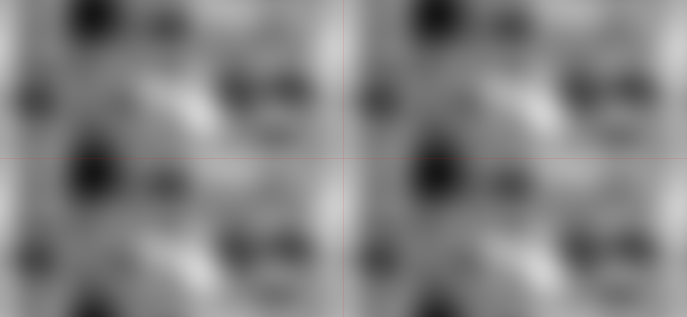
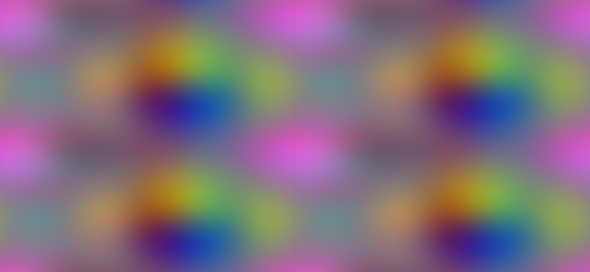
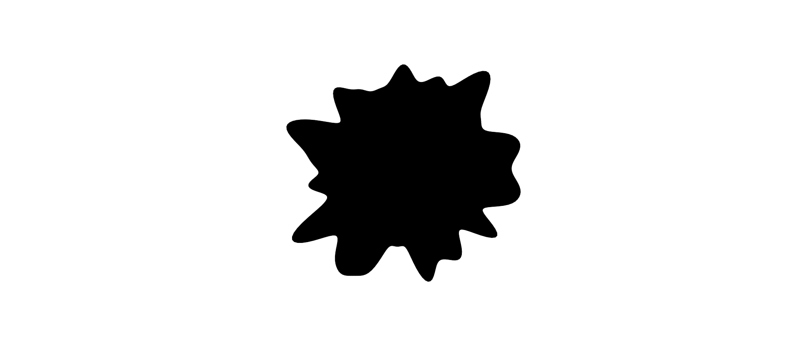

# TileableNoise.js

**TileableNoise.js** é uma simples classe que ajuda a criar imagens de ruídos que se conectam perfeitamente.
A implementação de [**ruído simplex**](https://github.com/jwagner/simplex-noise.js) por @jwagner é necessária.

## Introdução

Essa classe usa a ideia de pegar o resultado de uma função de ruído, andando em volta de um círculo, para que o valor inicial seja igual ao valor final, permitindo ruído conectável em 1D e 2D.\
Usando dois círculos em um espaço de ruído 4D é possível criar ruído repetível em um ambiente 2D.\
Eu tirei minha inspiração de um vídeo do Daniel Shiffman's: [Coding Challenge #136.1: Polar Perlin Noise Loops](https://www.youtube.com/watch?v=ZI1dmHv3MeM), do canal [The Coding Train](https://www.youtube.com/channel/UCvjgXvBlbQiydffZU7m1_aw).

## Examples

*Imagem feita com a class. As linhas vermelhas marcam o local da repetição.*

*Usando 3 instâncias da classe é possível criar uma imagem colorida e repetível.*

*Borrão circular pontiagudo feito com ruído, sem marcas que mostrar o início ou o fim.*

## Falta fazer (TODO)

- [x] Fazer uma versão minificada
- [ ] Otimizar a classe
- [ ] Fazer uma versão para Processing
- [ ] Adicionar animações em 2D? (Requer ruído 5D)
